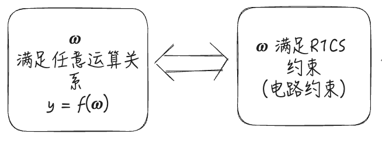

# zk-SNARK Groth16 详解

By: [Kong'](https://twitter.com/TycheKong)@SlowMist

⚓️**目录**
- [zk-SNARK Groth16 详解](#zk-snark-groth16-详解)
  - [什么是 zk-SNARK](#什么是-zk-snark)
    - [概述](#概述)
    - [拓展](#拓展)
  - [zk-SNARK 算法原理](#zk-snark-算法原理)
    - [核心](#核心)
  - [zk-SNARK 算法详解](#zk-snark-算法详解)
    - [1. 前置知识](#1-前置知识)
      - [多项式时间算法与非多项式时间算法](#多项式时间算法与非多项式时间算法)
      - [P 问题与 NP 问题](#p-问题与-np-问题)
      - [重要的 NP 问题——多项式整除](#重要的-np-问题多项式整除)
    - [2. 任意运算关系到阶为 1 的等式(R1CS)](#2-任意运算关系到阶为-1-的等式r1cs)
    - [3. R1CS 到向量内积](#3-r1cs-到向量内积)
    - [4. 向量内积到矩阵内积](#4-向量内积到矩阵内积)
    - [5. 矩阵内积到多项式组合运算](#5-矩阵内积到多项式组合运算)
      - [前置知识](#前置知识)
      - [应用](#应用)
    - [6. 多项式组合运算到 QAP 多项式(NP 问题)](#6-多项式组合运算到-qap-多项式np-问题)
    - [7. 快速验证](#7-快速验证)
    - [8. 可信设置](#8-可信设置)
    - [9. 进一步零知识构成](#9-进一步零知识构成)
  - [Groth16 协议解析](#groth16-协议解析)
    - [1. 协议原理](#1-协议原理)
      - [可信设置](#可信设置)
      - [证明](#证明)
      - [验证](#验证)
    - [2. 一致性](#2-一致性)
    - [3. 完备性](#3-完备性)
    - [4. 可靠性](#4-可靠性)
    - [5. 优缺点](#5-优缺点)
      - [优点](#优点)
      - [缺点](#缺点)
  - [参考](#参考)

## 什么是 zk-SNARK

### 概述

zkSNARK：zero-knowledge Succint Non-interactive ARguments of Knowledge (零知识简洁非交互式知识论证) 的简称：

zk：零知识，证明者隐藏所知道的输入。

Succinct：简洁性，生成可以快速验证的简短证明。

Non-interactive：非交互式，不需要来回交互。

ARguments：论证，验证者论证证明者所知道的输入。（验证者只对计算能力有限的证明者有效，拥有足够计算能力的证明者可以伪造证明，这也叫“计算可靠性”。)

Knowledge：知识，证明者所知道的输入。

简单来说，其就是使用算术化的方法，将计算类问题简化成涉及有限域上的多项式的代数问题。

$$f(x, w) = True/False$$

### 拓展

交互式零知识证明：证明方 𝒫 发送承诺给验证方 𝒱；验证方 𝒱 发送挑战给证明方 𝒫；证明方 𝒫 发送响应。(与TCP/IP协议的交互式类似）

非交互式证明：证明方 𝒫 生成证明，发送给验证方 𝒱；验证方 𝒱 验证一致性即可。其中，挑战是由证明方基于当前数据计算哈希获得，操控挑战的难度与 POW 相同，因此非交互式证明是安全。该过程没有其他额外的数据交互。例如：用户将ECDSA签名发送出去，共识节点进行一致性验证过程一样，整个过程只有一次数据发送。

## zk-SNARK 算法原理

### 核心

1. 将欲证明的问题(满足加法/乘法等任意运算关系)归约为 QAP/QSP 多项式，构成 NP 问题
   * 假设 P 问题 != NP 问题
2. 使用生成算法进行可信设置(CRS)，并公开 CRS
   * CRS 分成两部分 pk 与 vk
   * 可信安全多方计算
3. 证明方选择随机数 $(r,s \leftarrow Z_p)$ 与秘密 $w$ 以及 $pk$ 构造离散对数困难(多项式承诺)，生成 $proof$ 发给验证者
   * 随机数用于保护秘密
   * 通过将组合关系的组合多项式的系数放到椭圆曲线离散对数点上形成离散对数困难问题(多项式承诺)，对外暴漏 3 个离散对数点($proof$)
4. 验证者使用 $proof/vk$ 重构整除关系证明验证其是否正确
   * 使用双线性映射进行重构，快速验证 $w$ 的正确性，却不知道 $w$

## zk-SNARK 算法详解

### 1. 前置知识

#### 多项式时间算法与非多项式时间算法

**多项式时间算法**：能够快速计算出结果的算法。

* 已知私钥 $sk$ 和椭圆曲线生成元 $G$，求满足以下离散对数关系的公钥 $PK$

  $$PK := sk \cdot G$$

* 已知原象 $x$ 和哈希函 SHA256，求哈希数值 $y$
  
  $$y:=SHA256(x)$$

**非多项式时间算法**：无法快速计算出结果的算法，包括指数时间、亚指数时间算法。

* 离散对数，已知公钥 $PK$ 和椭圆曲线生成元 $G$，不能够在多项式时间内计算出私钥 $sk$，而需要指数时间才能计算私钥 $sk$
  
  $$PK = sk \cdot G$$

* 哈希求逆，已知函数值 $y$ 和哈希函数 SHA256，不能够在多项式时间内计算出原象 $x$，而需要指数时间才能计算原象 $x$
  
  $$y=SHA256(x)$$

#### P 问题与 NP 问题

一般认为 P 问题 != NP 问题

**P 问题**：在多项式时间内可解的问题。

**NP 问题**：多项式时间内不可计算的问题，需要指数时间或亚指数时间。但是一旦已知解，则能够在多项式时间内验证解是否正确。

`NP 问题的本质是单向性，不可快速逆向求解，但是能够快速正向验证。`

#### 重要的 NP 问题——多项式整除

已知 3 组的阶小于 n 的多项式 $u_0(x),u_1(x),...,u_m(x);$ $v_0(x),v_1(x),...,v_m(x);$ $w_0(x),w_1(x),...,w_m(x);$ 一个 n 阶目标多项式 $z(x)$，$z(x)$ = 0 的解为 $r_1,...,r_n$。且对于任意解 $r_j$，三组多项式的函数值的线性组合等于零，表达如下：

$$0 = (\sum_{i=0}^m{s_i \cdot u_i(r_j)}) \cdot (\sum_{i=0}^m{s_i \cdot v_i(r_j)})-(\sum_{i=0}^m{s_i \cdot w_i(r_j)})$$

求向量 $\vec{s}=(1,s_1,...,s_m)$ 是否满足以下整除关系？

$$z(x) | [(u_0(x)+\sum_{i=1}^m{s_i \cdot u_i(x)}) \cdot (v_0(x)+\sum_{i=1}^m{s_i \cdot v_i(x)})-(w_0(x)\sum_{i=1}^m{s_i \cdot w_i(x)})]$$

**为什么是 NP 问题：**

向量 $\vec{s}$ 三组多项式 $u_0(x),u_1(x),...,u_m(x);$ $v_0(x),v_1(x),...,v_m(x);$ $w_0(x),w_1(x),...,w_m(x);$ 进行线性组合，分别得到一个线性组合多项式：

$$u_0(x) + \sum_{i=1}^ms_i \cdot u_i(x)；v_0(x) + \sum_{i=1}^ms_i \cdot v_i(x)；w_0(x) + \sum_{i=1}^ms_i \cdot w_i(x)$$

其中，向量 $\vec{s}$ 的维度是 $m$，如果每个元素 $s_i$ 的取值空间为 $a>2$，则将线性组合多项式 $[u_0(x) + \sum_{i=1}^ms_i \cdot u_i(x)] \cdot [v_0(x) + \sum_{i=1}^ms_i \cdot v_i(x)] - [w_0(x) + \sum_{i=1}^ms_i \cdot w_i(x)]$ 称为**二次算法多项式**，简称 **QAP 多项式**。因此，QAP 多项式的构造为指数空间 $a^m$。如果每个元素 $s_i$ 的取值空间为 0 或 1，则将上述线性组合多项式称为**二次扩张多项式**或**二次布尔多项式**，简称 **QSP 多项式**，因此 QSP 多项式的构造为指数空间 $2^m$。

目标多项式 $z(x)$ 等于 0 有 n 个解 $r_1,...,r_n$，而 QAP/QSP 多项式等于零的解数量为 $2n-2$(因为 $m < n$，所以其阶最多 $(n-1) \cdot 2$ )，所以，除 $z(x)$ 等于 0 的 n 个解以外，QAP/QSP 多项式还有 $n-2$ 个其他解。因此，可以计算出**商多项式 $h(x)$**，且商多项式 $h(x)$ 就是 QAP/QSP 多项式等于零的剩余的 $n-2$ 个解构成的多项式：

$$h(x) := QAP / z(x)$$

如果不知道向量 $\vec{s}$，则只能随机选择一个向量计算 QAP/QSP 多项式，然后检测 $z(x)$ 与之是否满足整除关系。因此，需要指数时间才能够暴力搜索出向量 $\vec{s}$。并且一旦知道了向量 $\vec{s}$ 就可以快速基于其构造出 QAP/QSP 多项式，并验证其与 $z(x)$ 是否满足整除关系。所以多项式整除问题是 NP 问题。

### 2. 任意运算关系到阶为 1 的等式(R1CS)

任意多项式时间算法(包括 SHA256 和 ECDSA)均有对应的阶为 1 的等式(R1CS 约束)，以 $x^4+x^3+x^2+x=120$ 为例：

其等式可以做如下拆分：

$$
\begin{matrix}
s_1=x \cdot x \\
s_2=s_1 \cdot x \\
s_3=s_2 \cdot x \\
s_4=s_1 + x \\
s_5=s_4 + s_2 \\
120=s_5 + s_3
\end{matrix}
$$

这 6 个阶为 1 的等式限定了方程的运算规则，即能够用电路约束表达同样的运算规则。因此 $x=3$ 满足方程的解，等价于 $x=3$ 满足电路约束。$x$ 满足任意多项式时间运算 $y=f(x)$，等价于 $x$ 满足对应的电路约束。

`关键术语：阶为 1 的等式(Rank 1 Constraint System, R1CS)`

有以下规则：

​	阶为 1 的等式 = 电路约束「电路门」

​	阶为 1 的乘法等式 = 乘法约束「乘法门」

​	阶为 1 的加法等式 = 加法约束「加法门」

算式 10 为 6 个阶为 1 的等式，其包含 3 个乘法门和 3 个加法门，可使用 3 个乘法门和 3 个加法门实现对应的运算原理：

多个约束条件可以进行优化，如算式 10 的 6 个约束可以做以下优化：

$$
\begin{matrix}
s_1=x \cdot x \\
s_2=s_1 \cdot x \\
120-(s_2+s_1+x)=s_2 \cdot x
\end{matrix}
$$

算式 11 是将算式 10 中的加法约束优化到乘法约束中，其电路图如下：

为什么要优化耦合成乘法门？`最终 R1CS 以乘法门为标准门。`如果加法门不能够耦合到乘法门中，则将加法门乘 1 即可变为乘法门。如： $s_4=(s_1+x) \cdot 1$

因此多项式时间算法可以等价于 R1CS 约束，那么非多项式时间算法呢？

以哈希函数 SHA256 为例，其通过与、或、非、异或、循环移位等基础运算的耦合，进行线性变换与非线性变换(扩张与有损压缩)，输出256bits的随机数。以下是循环 64 次后输出函数值。其中，𝑥, 𝑦, 𝑧 位宽均为 32bits， $S_i$ 循环右移 $i$ bits， $R_i$ 循环右移 $i$ bits。

$$
\begin{matrix}
maj*(x,y,z)=(x \wedge y) \bigoplus (x \wedge z) \bigoplus (y \wedge z) \\
ch(x,y,z)=(x \wedge y) \bigoplus (\neg x \wedge y) \\
\Sigma_0(x)=S^2(x) \bigoplus S^{13}(x) \bigoplus S^{22}(x) \\
\Sigma_1=S^6(x) \bigoplus S^{11}(x) \bigoplus S^{25}(x) \\
\sigma_0=S^7(x) \bigoplus S^{18}(x) \bigoplus R^3(x) \\
\sigma_1=S^{17}(x) \bigoplus S^{19}(x) \bigoplus R^{10}(x)
\end{matrix}
$$

可对布尔值和异或运算进行转换，例如：

布尔值 $a$ 和 $b$ 等价转换为阶为 1 的等式：

$$
\begin{matrix}
(1-a) \times a = 0 \\
(1-b) \times b = 0
\end{matrix}
$$

位异或运算 $a \bigoplus b = c$ 等价转换为4个阶为1的等式：

$$
\begin{matrix}
(1-a) \times a = 0 \\
(1-b) \times b = 0 \\
(1-c) \times c = 0 \\
2a \times b = a+b-c \\
\end{matrix}
$$

因此布尔值 $a$ 和 $b$ 可以等价为 2 个阶为 1 的等式，位异或运算 $a \bigoplus b = c$ 可以等价为 4 个阶为 1 的等式，因此其可以等价为电路约束。最终可将算式 12 都转换为阶为 1 的电路约束，即非多项式时间算法可以等价转换为阶为 1 的 R1CS 约束。

推论 1：满足任意运算关系 $y=f(\omega)$ 的 $\omega$ 等价为 $\omega$ 满足 R1CS 约束(电路约束)。

### 3. R1CS 到向量内积

上述算式 11 的解 $x=3$，依据线性方程到向量的知识我们可以知道向量 $\vec{s}=[1,out,x,s_1,s_2]$ 与 $x = 3$ 等价。即已知解可以根据算式算出向量值，已知向量，且向量包含 $x$ 可以推出其值。而对于算式 10，我们可以知道 $\vec{s}=[1,out,x,s_1,s_2,s_3,s_4,s_5]$ 也会与 $x$ 的解等价。

为什么使用算式 11 而不使用算式 10？因为算式 10 的包含了更多的变量，这会使得后续从向量到矩阵的维度变得更大，使得最后会产生更高阶的多项式。因此使用优化后的算式 11 作为约束。

对于 $x$ 与 $\vec{s}$ 的等价关系，我们可以对算式 11 进行向量内积转换，对于第一个等式 $s_1 = x \cdot x$

$$
\begin{Bmatrix}
	\vec{s} \cdot [0,0,0,1,0] = [1,out,x,s_1,s_2] \cdot [0,0,0,1,0] = s_1 \\
	\vec{s} \cdot [0,0,1,0,0] = [1,out,x,s_1,s_2] \cdot [0,0,1,0,0] = x \\
	\vec{s} \cdot [0,0,1,0,0] = [1,out,x,s_1,s_2] \cdot [0,0,1,0,0] = x 
\end{Bmatrix}
$$

令 $w_1=[0,0,0,1,0],u_1=[0,0,1,0,0],v_1=[0,0,1,0,0]$ 可得：

$$(s_1=x \cdot x) \iff (\vec{s} \cdot w_1 = \vec{s} \cdot u_1 \times \vec{s} \cdot v_1)$$

对于第二与第三个等式，同理可得：

$$
\begin{Bmatrix}
	\vec{s} \cdot [0,0,0,0,1] = [1,out,x,s_1,s_2] \cdot [0,0,0,0,1] = s_2 \\
	\vec{s} \cdot [0,0,0,1,0] = [1,out,x,s_1,s_2] \cdot [0,0,0,1,0] = s_1 \\
	\vec{s} \cdot [0,0,1,0,0] = [1,out,x,s_1,s_2] \cdot [0,0,1,0,0] = x
\end{Bmatrix}
$$

令 $w_2=[0,0,0,0,1],u_2=[0,0,0,1,0],v_2=[0,0,1,0,0]$ 可得 $\vec{s} \cdot w_2 = \vec{s} \cdot u_2 \times \vec{s} \cdot v_2$

$$
\begin{Bmatrix}
	\vec{s} \cdot [0,1,-1,-1,-1] = [1,out,x,s_1,s_2] \cdot [0,1,-1,-1,-1] = 120-(s_2+s_1+x) \\
	\vec{s} \cdot [0,0,0,0,1] = [1,out,x,s_1,s_2] \cdot [0,0,0,0,1] = s_2 \\
	\vec{s} \cdot [0,0,1,0,0] = [1,out,x,s_1,s_2] \cdot [0,0,1,0,0] = x
\end{Bmatrix}
$$

令 $w_3=[0,1,-1,-1,-1],u_3=[0,0,0,0,1],v_3=[0,0,1,0,0],$ 可得 $\vec{s} \cdot w_3 = \vec{s} \cdot u_3 \times \vec{s} \cdot v_3$

因此我们可以做出推论 2： $\omega$ 满足 R1CS 约束等价转换为向量 $\vec{s}$ 与多维向量 $(u_i,v_i,w_i) (i=1,2,3)$ 的內积。

### 4. 向量内积到矩阵内积

将算式 15、17、18 中的多维向量，按照顺序排列，可以组成三个矩阵 $M,U,V$

$$
W = \begin{bmatrix}
w(1)\\
w(2)\\
w(3)
\end{bmatrix} = \begin{bmatrix}
0&0&0&1&0 \\
0&0&0&0&1 \\
0&1&-1&-1&-1
\end{bmatrix} \\
U = \begin{bmatrix}
u(1)\\
u(2)\\
u(3)
\end{bmatrix} = \begin{bmatrix}
0&0&1&0&0 \\
0&0&0&1&0 \\
0&0&0&0&1
\end{bmatrix} \\
V = \begin{bmatrix}
v(1)\\
v(2)\\
v(3)
\end{bmatrix} = \begin{bmatrix}
0&0&1&0&0 \\
0&0&1&0&0 \\
0&0&1&0&0
\end{bmatrix}
$$

因此存在以下等价关系：

$$
\begin{matrix}
\vec{s} \cdot w(1) = \vec{s} \cdot u(1) \times \vec{s} \cdot v(1) \\
\vec{s} \cdot w(2) = \vec{s} \cdot u(2) \times \vec{s} \cdot v(2) \\
\vec{s} \cdot w(3) = \vec{s} \cdot u(3) \times \vec{s} \cdot v(3) \\
\Updownarrow \\
\vec{s} \cdot W = \vec{s} \cdot U \times \vec{s} \cdot V
 \end{matrix}
$$

我们可以做出推论 3：向量 $\vec{s}$ 与多维向量 $(u_i,v_i,w_i) (i=1,2,3)$ 的內积等价转换为向量 $\vec{s}$ 与矩阵 $U,V,W$ 的内积。

### 5. 矩阵内积到多项式组合运算

#### 前置知识

**`多项式值表达等价于多项式系数表达`**

设 $n-1$ 阶多项式为 $f(x) = \sum_{i=0}^m a_ix^{i-1}$，那么已知多项式值 $f_0,...,f_m$ 和横坐标 $x_0,...,x_m$，可以快速计算出多项式的系数 $a_0,...,a_m$。(拉格朗日插值法/快速傅立叶变换等方式)。而已知多项式的系数 $a_0,...,a_m$ 和横坐标 $x_0,...,x_m$，可以计算出多项式的值 $f_0,...,f_m$。(快速傅立叶变换等)。因此我们可以得出**多项式值表达等价于多项式系数表达**。

#### 应用

将方程 $x^4+x^3+x^2+x=120$ 转换为 R1CS 约束后，我们可以得到算式 19 的三个矩阵 $W,U,V$。将矩阵中的元素作为多项式的值，我们将其转换为多项式系数表达，以 $W$ 矩阵为例：

$$
\begin{matrix}
w_0(1)=0,w_1(1)=0,w_2(1)=0,w_3(1)=1,w_4(1)=0 \\
w_0(2)=0,w_1(2)=0,w_2(2)=0,w_3(2)=0,w_4(2)=1 \\
w_0(3)=0,w_1(3)=1,w_2(3)=-1,w_3(3)=-1,w_4(3)=-1
 \end{matrix}
$$

对于多项式的值，每一列有 3 个函数值，所以取任意 3 个横坐标 $x=1,2,3$。我们使用拉格朗日插值法，基于多项式的值计算多项式系数：

$$f(x)=\sum_{k=1}^tf_k \prod_{j=1,j\neq k}^t \frac{x-x_j}{x_k-x_j}$$

展开计算，则多项式系数表达： $W(x)=[w_0(x),w_1(x),w_2(x),w_3(x),w_4(x)]$

以此类推 $U$ 矩阵与 $V$ 矩阵的多项式系数表达式 $U(x)=[u_0(x),u_1(x),u_2(x),u_3(x),u_4(x)]；V(x)=[v_0(x),v_1(x),v_2(x),v_3(x),v_4(x)]$

因此存在以下等价关系：

$$
\begin{matrix}
\vec{s} \cdot W = \vec{s} \cdot U \times \vec{s} \cdot V \\
\Updownarrow \\
\vec{s} \cdot W(x) = \vec{s} \cdot U(x) \times \vec{s} \cdot V(x)，(x=1,2,3) \\
\Updownarrow \\
\vec{s} \cdot U(x) \times \vec{s} \cdot V(x) - \vec{s} \cdot W(x) = 0，(x=1,2,3)
 \end{matrix}
$$

等式 $\vec{s} \cdot U(x) \times \vec{s} \cdot V(x) - \vec{s} \cdot W(x) = 0$ 是向量 $\vec{s}$ 对三组多项式的组合运算，其运算结果称为二次算法多项式，简称 **`QAP 多项式`**。

我们可以得到推论 4：向量 $\vec{s}$ 与矩阵内积等价转换为向量 $\vec{s}$ 对多项式 $W(x),U(x),V(x) [w_i(x),u_i(x),v_i(x),(i=0,...,m)]$ 的组合运算。

### 6. 多项式组合运算到 QAP 多项式(NP 问题)

根据步骤 5 中使用拉格朗日插值法引入的横坐标 $x=1,2,3$，则可以构造多项式：

$$z(x)=(x-1)(x-2)(x-3)$$

此 $z(x)$ 算式称之为**目标多项式**(如果选择 4，5，6 就是重新使用拉朗计算，并构造目标多项式)。

根据步骤 5 我们可以知道当 $x=1,2,3$ 时，目标多项式 $z(x)$ 与 QAP 多项式 $\vec{s} \cdot U(x) \times \vec{s} \cdot V(x) - \vec{s} \cdot W(x)$ 都为零，但 QAP 多项式的阶肯定是高于目标多项式 $z(x)$ (相乘的阶肯定大于 n)，因此 QAP 多项式除了 1，2，3 外肯定还有其他解。所以目标多项式是 QAP 多项式的因子，即目标多项式与 QAP 多项式呈整除关系：

$$z(x) \mid \vec{s} \cdot U(x) \times \vec{s} \cdot V(x) - \vec{s} \cdot W(x)$$

根据我们前置知识中的多项式整除问题，我们可以得出推论：向量 $\vec{s}$ 对多项式 $W(x),U(x),V(x) [w_i(x),u_i(x),v_i(x),(i=0,...,m)]$ 的组合运算等价于目标多项式 $z(x)$ 与 QAP 多项式呈整除关系，即构成 **NP 问题**。

至此，我们通过严格的数学关系推导了从任意运算关系到 QAP/QSP 多项式并构成 NP 问题的证明。

### 7. 快速验证

通过上述步骤我们知道向量 $\vec{s}$ 是我们需要保护的秘密，目标多项式 $z(x)$ 与 QAP 多项式是公开的，但只有知道了向量 $\vec{s}$ 才能构造出 QAP 多项式，才能证明整除关系，这就与零知识相悖了。

因此证明方 𝓟 不公开该 NP 问题的向量 $\vec{s}$ 而是将其构造为 QAP 多项式除以目标多项式，得到商多项式 $h(X)$：

$$h(x) := \frac {\vec{s} \cdot U(x) \times \vec{s} \cdot V(x) - \vec{s} \cdot W(x)} {z(x)}$$

随后将商多项式、目标多项式、QAP 多项式的系数放到椭圆曲线离散对数上(多项式承诺)生成离散对数点(证明)，并对外暴露点 $A_1,B_2,C_1$。验证方 𝒱 获得离散对数点后可以基于双线性映射重构整除关系，验证其是否正确。这就验证了向量 $\vec{s}$ 是否正确，而不知道向量 $\vec{s}$ 的值。

那么，何谓双线性映射呢？就是在 ECDSA 中熟知的配对！

**配对 Pairing：**

配对(Pairing): 将输入的两个群成员映射为第三个群的成员，将配对记为 $e$

$$e: G_1 \times G_2 \rightarrow G_T$$

上式左边的群由椭圆曲线上的点构成；右边的群被称为目标群，通常是一些大型有限群。

*(我们不深入了解更多的群论知识，直接给出特性并距离来说明双线性映射)*

配对必须具备一些代数特征，下面是最重要的一个，被称为双线性：

$$
\begin{matrix}
e(A, B+C) = e(A,B) \cdot e(A,C) \\
e(A+B, C) = e(A,C) \cdot e(B,C) \\
e(nA,B) = e(A,nB)=e(A,B)^n
\end{matrix}
$$

配对的另一个重要特征是非退化性(non-degeneracy)：

$$e(G,G) \neq 1$$

右边的 1 表示目标群中的乘法单位元。非退化性保证了只要我们选择椭圆曲线上的非单位成员 G，就能得到目标群中的非单位元。

具有以上性质的配对可以用于验证一个数学过程是否正确，这也是配对在zk-SNARK中的用途。例如，假设我声称自己知道一个满足以下二次方程的数值：

$$x^2-x-42=0$$

为了说服你我的确知道上述方程的一个解，一个办法就是告诉你我知道的这个解，然后你自己带入上述方程去验证。另一个办法就是我不告诉你这个具体的解是多少，但是使用椭圆曲线上的配对进行验证。

首先如果 $e(G,G)^k = 1$，那么 $k$ 要么是 0，要么是群的阶的倍数，因此如果以下等式成立，我们就可以确定二次方程成立：

$$e(G,G)^{x^2-x-42} = 1$$

利用双线性，我们可以将其重写为：

$$
\begin{matrix}
e(G,G)^{x^2} \cdot e(G,G)^{-x} \cdot e(G,G)^{-42} = 1 \\
\Downarrow \\
e(xG,xG) \cdot e(xG, -G) \cdot e(G, -42G) = 1
\end{matrix}
$$

现在，不需要验证原始的二次方程成立，只需要验证上面这个配对方程成立即可。因此我不需要提供 $x$ 的具体数值，只需要告诉验证人 $xG$ 就可以了。(类似椭圆曲线私钥倍点运算得到公钥)。

利用配对的特性，验证方 𝓥 就可以在不知道向量 $\vec{s}$ 的值的情况验证整除关系是否成立，也就验证了 $\omega$ 满足 R1CS 约束，证明了证明方 𝒫 对数据的运算是正确且提交了正确的数据。

$$Pairing(A_1,B_2) = Pairing(C_1,G_2)$$

### 8. 可信设置

由于证明者知道向量 $\vec{s}$ 的值，那么证明者是很容易伪造一个新的值使其满足运算关系的。因此就需要一个可信设置生成有毒废料参与计算，有毒废料一般来源于安全多方计算，只要其中一方诚实的删除了有毒废料，则可以认为 CRS 是安全的。(这里不进一步探讨 CRS 的安全性)

在通过 CRS 随机生成 $\alpha$ 和 $\beta$，创建椭圆曲线点 $\alpha G$ 和 $\beta G$ ，然后销毁 $\alpha$ 和 $\beta$，也就是说新的 $A_1$ 和 $B_2$ 与旧的有如下关系：

$$
\begin{matrix}
A_{new1} = A_{old1} + \alpha_1 \\
B_{new2} = B_{old2} + \beta_2
\end{matrix}
$$

通过上述关系，可以得到新的整除关系：

$$
\begin{matrix}
h(x) := \frac {\vec{s} \cdot U(x) \times \vec{s} \cdot V(x) - \vec{s} \cdot W(x)} {z(x)} \\
\Downarrow \\
h(x) = \frac {\sum_{i=0}^m a_i u_i(x) \sum_{i=0}^m a_i v_i(x) - \sum_{i=0}^m a_i w_i(x)} {z(x)} \\
\Downarrow \\
\sum_{i=0}^m a_i u_i(x) \sum_{i=0}^m a_i v_i(x) = \sum_{i=0}^m a_i w_i(x) + h(x)z(x) \\
\Downarrow \\
(\alpha + \sum_{i=0}^m a_i u_i(x))(\beta + \sum_{i=0}^m a_i v_i(x)) = \alpha \beta + \sum_{i=0}^m a_i(\beta u_i(x)+\alpha v_i(x)+w_i(x)) + h(x)z(x)
\end{matrix}
$$

所以证明方在计算 $A$ 的时候需要诚实包含 $\alpha$，在计算 $B$ 的时候需要诚实包含 $\beta$，$A$ 和 $B$ 相乘，才会出现 $\alpha \cdot \beta$。如果证明方作弊，如：令 $A$ 中包含  $\alpha \cdot \beta$，而 $B$ 中包含或不包含 $\alpha \cdot \beta$，则证明方无法构造出等式右边。因此 $\alpha$ 和 $\beta$ 迫使证明 $A,B,C$ 必须要采用同一套 statement 而不能是其他参数。

**题外:** 具体协议具体分析，Groth16 的 CRS 包含 R1CS 约束等价转化的电路多项式 $w(x),U(x),v(x)$。而 PLONK 协议的 CRS 不包含电路多项式 $w(x),U(x),v(x)$，只包含大量的离散对数点。

### 9. 进一步零知识构成

但此时，我们的方案还是完全具备零知识性，当我们的秘密来自于猜测范围较小的输入时，攻击者还是能够猜测我们的数据。为此，我们引入了一个随机移位 $r,s$ 用于保护我们的秘密，使得 $A,B,C$ 更具有随机性。新的离散对数点如下: (其中 $\gamma$ , $\delta$ 是由可信设置生成为了防止证明者与验证者串通伪造公共输入，这里不做展开)

$$
\begin{matrix}
A_1 = \alpha + \sum_{i=0}^m a_i u_i(x) + r \delta \\
B_2 = \beta + \sum_{i=0}^m a_i v_i(x) + s \delta \\
C_1 = \frac {\sum_{i=l+1}^m a_i(\beta u_i(x)+\alpha v_i(x)+w_i(x)) + h(x)z(x)} {\delta} +As + Br - rs\delta
\end{matrix}
$$

不管 $r,s$ 为何值，等式展开后都不会影响其成立。(详看 Groth16 一致性分析)

## Groth16 协议解析

### 1. 协议原理

#### 可信设置

**初始化CRS：**选择**有毒废料**随机数 $\alpha, \beta, \gamma, \delta, x \leftarrow \mathbb{Z}_p^*$，计算系统参数 CRS：

$$
\sigma_1 = \begin{pmatrix} 
\alpha, \beta, \gamma, \delta, {\begin{Bmatrix} x^i \end{Bmatrix}}_{i=0}^{n-1}, \begin{Bmatrix} \frac {\beta u_i(x) + \alpha v_i(x) + w_i(x)}{\gamma} \end{Bmatrix} _{i=0}^l \\
\begin{Bmatrix} \frac{\beta u_i(x) + \alpha v_i(x) + w_i(x)}{\delta} _{i=l+1}^{n-1} \end{Bmatrix}, \begin{Bmatrix} \frac{x^iz(x)}{\delta} _{i=0}^{n-2} \end{Bmatrix}
\end{pmatrix}
$$

$$
\sigma_2 = (\beta, \gamma, \delta, {\lbrace x^i \rbrace}_{i=0}^{n-1})
$$

有毒废料两种计算方法：

​	(1) 硬件计算，但每次计算后都需要破坏硬件。 

​	(2) 安全多方计算，只要有一个参与方删除有毒废料，则 CRS 安全。

​	缺点：算法更新，则电路更新，则 CRS 更新，但是 CRS 计算复杂度比较高。(Plonk 的 CRS 是通用的，算法更新，则电路更新，仅更新 vk，而不需要更新基于有毒废料计算出的那部分 CRS，因为其不包含电路多项式 $W(X)\,U(X)\,V(X)$ )

#### 证明

证明方 𝒫 选择随机数 $r,s \leftarrow \mathbb{Z}_p$，基于向量 $\vec{s} = (a_1,...,a_m)$ 和 CRS，构造线性组合关系，并将组合多项式的系数放到椭圆曲线离散对数点上，形成离散对数困难问题。对外暴漏 3 个离散对数点 $A_1,B_2,C_1$。这使得 proof size 小，验证复杂度很低。

$$
\begin{matrix}
A_1 = \alpha + \sum_{i=0}^m a_i u_i(x) + r \delta \\
B_2 = \beta + \sum_{i=0}^m a_i v_i(x) + s \delta \\
C_1 = \frac {\sum_{i=l+1}^m a_i(\beta u_i(x)+\alpha v_i(x)+w_i(x)) + h(x)z(x)} {\delta} +As + Br - rs\delta
\end{matrix}
$$

#### 验证

验证方 𝒱 对椭圆曲线离散对数点重构整除关系，如果等式成立，则验证成功，否则拒绝。

$$e(A_1,B_2) = e(\alpha G_1, \beta G_2) \cdot e(\sum_{i=0}^l \frac {\beta u_i(x) + \alpha v_i(x) + w_i(x)}{\gamma} G_1, \gamma G_2) \cdot e(C_1,\delta G_2)$$

### 2. 一致性

基于上述等式展开：

**等式左边**

$$A \cdot B = (\alpha + \sum_{i=0}^m a_i u_i(x) + r \delta) \cdot (\beta + \sum_{i=0}^m a_i v_i(x) + s \delta) = \alpha \beta + \alpha s \delta + r\delta \beta + rs \delta^2 + \alpha \cdot \sum_{i=0}^m a_i v_i(x) + \beta \cdot \sum_{i=0}^m a_i u_i(x) + \color{#F00} {\sum_{i=0}^m a_i u_i(x) \sum_{i=0}^m a_i v_i(x)} + s\delta \sum_{i=0}^m a_i u_i(x) + r\delta \sum_{i=0}^m a_i v_i(x)$$

**等式右边**

$$\alpha \beta + \frac {\sum_{i=0}^l a_i(\beta u_i(x)+\alpha v_i(x)+w_i(x)) + h(x)z(x)}{\gamma} \gamma + C\delta = \alpha \beta + s\delta \alpha + s\delta \sum_{i=0}^m a_i u_i(x) + rs\delta^2 + r\delta \beta + r\delta \sum_{i=0}^m a_i v_i(x) + rs\delta^2 - rs\delta^2 + \alpha \cdot \sum_{i=0}^m a_i v_i(x) + \beta \cdot \sum_{i=0}^m a_i u_i(x) + \color{#F00} {\sum_{i=0}^m a_i w_i(x) + h(x)z(x)}$$

最终仍然是证明此等式的整除关系，与未添加其他参数的等式保持一致。

$$h(x) = \frac {\sum_{i=0}^m a_i u_i(x) \sum_{i=0}^m a_i v_i(x)-\sum_{i=0}^m a_i w_i(x)} {z(x)}$$

*上述计算过程来自于 lynndell 博士*

### 3. 完备性

验证方 𝒱 验证上述等式成立，则可以知道证明方知道该 NP 问题的解，体现了完备性。

### 4. 可靠性

验证等式的右边包含了 $\alpha \cdot \beta$，所以证明方在计算 $A$ 的时候需要诚实包含 $\alpha$，在计算 $B$ 的时候需要诚实包含 $\beta$， $A$ 和 $B$ 相乘，才会出现 $\alpha \cdot \beta$。这使得证明方无法作弊，证明者不能说服验证者接受错误的陈述。

### 5. 优缺点

#### 优点

* Groth16 的 CRS 包含 R1CS 约束等价转化的电路多项式，非常具体。
* Groth16 证明只包含三个离散对数点，数据量小，证明小。
* Groth16 验证方式极为简洁，验证复杂度低，速度快。

#### 缺点

* Groth16 CRS 包含的电路多项式是由 R1CS 约束转换而来，已经固化，只能表达唯一运算电路，不能表达其他运算电路，表达能力极差。
* Groth16 是非通用的，它依赖于一次性不可升级的设置，灵活性低。
* Groth16 需要可信设置，存在中心化作恶风险。

## 参考

[1] Jens Groth, [On the Size of Pairing-based Non-interactive Arguments](https://eprint.iacr.org/2016/260.pdf).

[2] Dr. Lynndell, zkSnark—Groth16 证明系统.

[3] Joshua Fitzgerald, [What are zk-SNARKs? Pairings (Part 1)](https://medium.com/coinmonks/what-are-zk-snarks-pairings-part-1-a76b58f1a51b)

[4] [Succinct non-interactive arguments via linear interactive Proofs](https://link.springer.com/chapter/10.1007/978-3-642-36594-2_18), Nir Bitansky, Alessandro Chiesa, Yuval Ishai, Rafail Ostrovsky, Omer Paneth, Theory of Cryptography Conference 2013

[5] [Scalable Zero Knowledge via Cycles of Elliptic Curves](https://eprint.iacr.org/2014/595.pdf), Eli Ben-Sasson, Alessandro Chiesa, Eran Tromer, Madars Virza, CRYPTO 2014

[6] [snarkjs](https://github.com/iden3/snarkjs)
